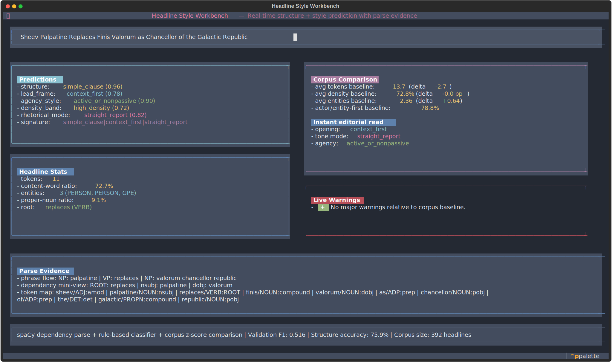
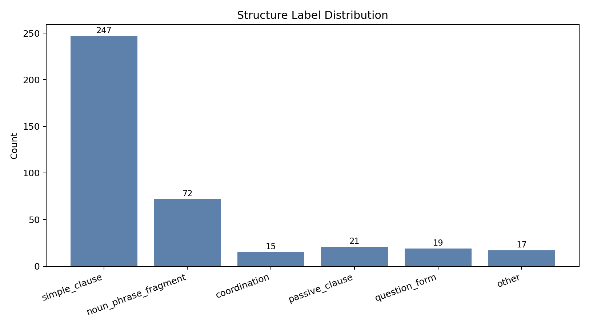
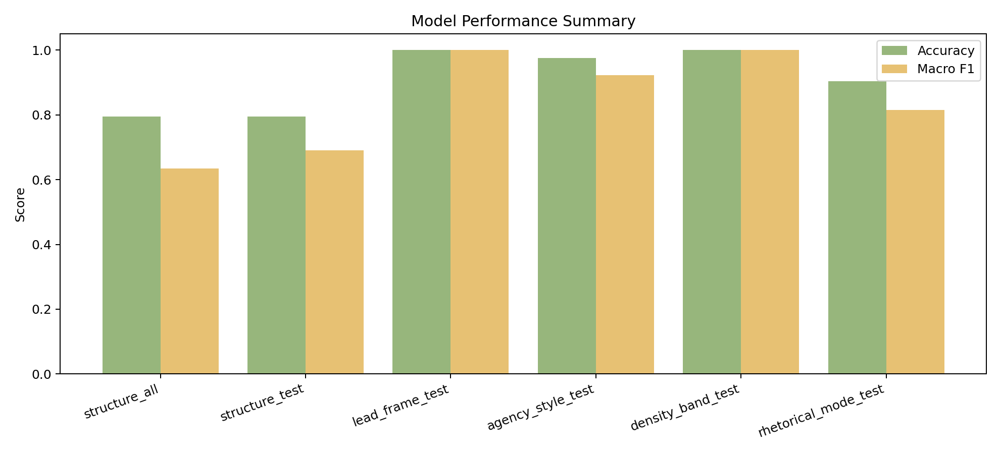
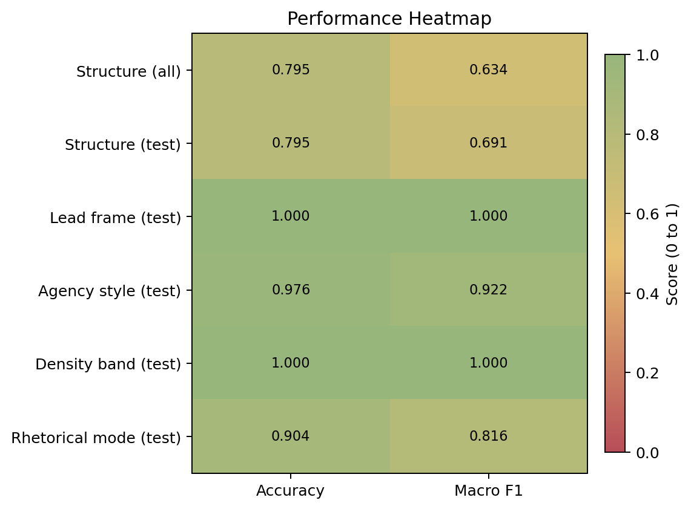

# Structural Patterns in News Headlines



This project studies headline **form** (syntax and framing), not topic meaning.
We ask: **Do news headlines follow repeatable structural templates, and can we measure them reliably?**

## Pipeline

1. Collect domestic/world headlines from Google News RSS.
2. Parse with spaCy (POS, dependencies, entities, roots).
3. Analyze structural patterns.
4. Predict a style profile per headline.
5. Evaluate against manual gold annotations.

## What the data says

From `391` parsed headlines:
- Average length: `13.7` tokens
- Content-word ratio: `73.2%`
- Headlines with verbs: `92.1%`
- Active voice: `94.6%` (passive `5.4%`)
- Headlines with named entities: `95.7%` (avg `2.4`)
- Actor/entity-first openings: `81.6%`

Interpretation: this corpus is mostly dense, actor-led **who-did-what** reporting.



## Model outputs

Each headline gets a style profile:

- `structure`: `question_form`, `passive_clause`, `coordination`, `noun_phrase_fragment`, `simple_clause`, `other`
- `lead_frame`: `actor_entity_first`, `event_first`, `action_first`, `context_first`, `other_lead`
- `agency_style`: `active_or_nonpassive`, `passive_with_agent`, `passive_agent_omitted`
- `density_score` + `density_band`
- `rhetorical_mode`: `straight_report`, `analysis_explainer`, `question_hook`, `live_or_alert`

Example signature: `simple_clause | actor_entity_first | straight_report`

## Manual annotation and evaluation

Manual files:
- `data/gold_headlines_full_manual.csv` (manual `gold_label` for all 391)
- `data/gold_headlines_style_manual.csv` (manual `gold_rhetorical_mode` for all 391)

Split of manually annotated headlines:
- Train: `233` (`59.6%`)
- Dev: `75` (`19.2%`)
- Held-out test: `83` (`21.2%`)

### Structure model scores
- All-labeled: accuracy `0.795`, macro F1 `0.634`
- Dev macro F1 `0.561`
- Held-out test macro F1 `0.691`

### Style-dimension scores
All-labeled (`n=391`):
- `lead_frame`: accuracy `1.000`, macro F1 `1.000`
- `agency_style`: accuracy `0.949`, macro F1 `0.678`
- `density_band`: accuracy `1.000`, macro F1 `1.000`
- `rhetorical_mode`: accuracy `0.905`, macro F1 `0.790`

Held-out test (`n=83`):
- `lead_frame`: accuracy `1.000`, macro F1 `1.000`
- `agency_style`: accuracy `0.976`, macro F1 `0.922`
- `density_band`: accuracy `1.000`, macro F1 `1.000`
- `rhetorical_mode`: accuracy `0.904`, macro F1 `0.816`





Note: perfect `lead_frame` and `density_band` scores are expected in this setup, because their gold columns are operationalized with the same deterministic labeling rules used by the profiler. Treat those as consistency checks, while `structure`, `agency_style`, and especially `rhetorical_mode` are the more informative generalization signals.

Metric definitions:
- Accuracy = correct predictions / total predictions
- Precision = correct positives / predicted positives
- Recall = correct positives / actual positives
- F1 = harmonic mean of precision and recall
- Macro F1 = unweighted average F1 across classes

## Manual tagging examples (expanded)

1. Headline: `Nine killed in second Turkish school shooting in two days`  
   - Manual `gold_label`: `passive_clause`  
   - Manual `gold_rhetorical_mode`: `straight_report`  
   - Rationale: compressed passive pattern (`NUM + VBN`) with factual event framing.

2. Headline: `Iran Update Special Report, April 14, 2026 Institute for the Study of War`  
   - Manual `gold_label`: `noun_phrase_fragment`  
   - Manual `gold_rhetorical_mode`: `analysis_explainer`  
   - Rationale: report/explainer framing with no finite main clause.

## Worked prediction examples

### Example 1: Question headline

Headline: `Are we witnessing the death of expertise?`

Decision path:
1. Contains `?` -> matches question rule.
2. Question has highest priority -> output immediately.

Predictions:
- `structure`: `question_form`
- `lead_frame`: `action_first`
- `agency_style`: `active_or_nonpassive`
- `density_band`: `medium_density`
- `rhetorical_mode`: `question_hook`

### Example 2: Passive headline

Headline: `Nine killed in second Turkish school shooting in two days`

Decision path:
1. Not a question.
2. Matches passive headline pattern `NUM + VBN` (`Nine` + `killed`).
3. Returns passive class.

Predictions:
- `structure`: `passive_clause`
- `lead_frame`: `context_first`
- `agency_style`: `passive_agent_omitted`
- `density_band`: `high_density`
- `rhetorical_mode`: `straight_report`

### Example 3: Coordination + explainer headline

Headline: `Actuarial Warfare: How Seven Insurance Letters Closed the World's Most Critical Chokepoint and Why Markets Are Mispricing Duration by 300% Shanaka Anslem Perera`

Decision path:
1. Not a question and not passive.
2. Contains coordinated clause logic (`... and Why ...`) and multi-part analysis framing.
3. Coordination rule fires before fallback rules.

Predictions:
- `structure`: `coordination`
- `lead_frame`: `actor_entity_first`
- `agency_style`: `active_or_nonpassive`
- `density_band`: `high_density`
- `rhetorical_mode`: `analysis_explainer`

### Example 4: Noun-phrase fragment headline

Headline: `Iran Update Special Report, April 14, 2026 Institute for the Study of War`

Decision path:
1. No question signal.
2. No passive pattern.
3. No clear finite clause.
4. Matches nominal/fragment-style headline pattern.

Predictions:
- `structure`: `noun_phrase_fragment`
- `lead_frame`: `actor_entity_first`
- `agency_style`: `active_or_nonpassive`
- `density_band`: `high_density`
- `rhetorical_mode`: `analysis_explainer`

### Example 5: Simple clause headline

Headline: `House Democrats file articles of impeachment against Hegseth`

Decision path:
1. Not question, passive, or coordination.
2. Has a clear finite clause pattern (subject + verb + object/complement).
3. Falls into the default clause class.

Predictions:
- `structure`: `simple_clause`
- `lead_frame`: `actor_entity_first`
- `agency_style`: `active_or_nonpassive`
- `density_band`: `high_density`
- `rhetorical_mode`: `straight_report`

## Practical use cases

1. Compare framing patterns across domains (domestic vs world).
2. Monitor newsroom style shifts over time.
3. Use style profiles as interpretable features in downstream NLP.

## Project structure

```text
.
├── README.md
├── requirements.txt
├── data/
│   ├── headlines.json
│   ├── headlines_parsed.json
│   ├── gold_headlines_full_manual.csv
│   ├── gold_headlines_style_manual.csv
│   ├── evaluation/
│   └── evaluation_style/
└── scripts/
    ├── pipeline/
    │   ├── collect_headlines.py
    │   ├── parse_headlines.py
    │   └── analyze_structure.py
    └── model/
        ├── headline_structure_classifier.py
        ├── headline_style_profiler.py
        ├── evaluate_style_profile.py
        └── run_structure_pipeline.py
```

## Setup

```bash
python -m venv venv
source venv/bin/activate
pip install -r requirements.txt
python -m spacy download en_core_web_sm
```

## Run

```bash
# 1) Collect
python scripts/pipeline/collect_headlines.py

# 2) Parse
python scripts/pipeline/parse_headlines.py

# 3) Analyze
python scripts/pipeline/analyze_structure.py

# 4) Full model + evaluation pipeline
python scripts/model/run_structure_pipeline.py

# 5) Real-time reporter workbench (Textual TUI)
python scripts/app/headline_live_tui.py
```
