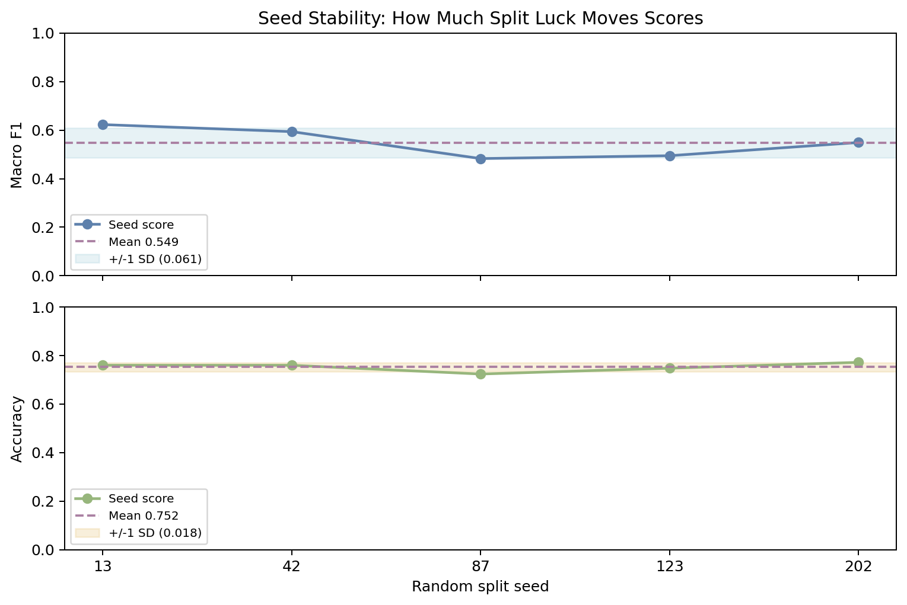

# Structural Patterns in News Headlines: A Computational Linguistic Analysis Using NLP

**Victor Derani, Avi Herman, Kylie Lin**  
*Department of Computer Science*  
*NLP Final Project*

---

## Abstract

News headlines are highly compressed linguistic objects: they must communicate maximal information under extreme length constraints. This study investigates whether headline construction follows stable syntactic rules that can be modeled computationally without deep semantic interpretation. We build an end-to-end NLP pipeline that collects RSS headlines, parses them with spaCy, extracts POS/dependency/entity features, and predicts both structural and stylistic labels using rule-based classifiers.

Using a manually annotated **gold-standard reference set** (human-verified labels used as ground truth), we evaluate a six-class structural classifier and a multi-dimensional style profiler (`lead_frame`, `agency_style`, `density_band`, `rhetorical_mode`). On held-out test data, the structure model reaches **0.759 accuracy** and **0.594 macro F1**. Relative to test baselines, this is a +12.0 percentage-point gain in accuracy over majority prediction and a +31.3 percentage-point gain over random assignment, with macro F1 improving from 0.130 (majority) and 0.187 (random) to 0.594. Style dimensions show strong performance for framing and density labels (e.g., `density_band` test macro F1 **0.958**) and moderate performance for rhetorical distinctions. To quantify split luck, we run a 5-seed stability sweep and report mean plus variance rather than a single point estimate (structure test macro F1: **0.549 +/- 0.061**).

Results show that headline writing is governed by recurrent structural templates, high information density, and consistent agency/framing patterns. The work contributes a reproducible, interpretable framework for headline form analysis with practical value for summarization, newsroom style auditing, and media framing research.

---

## 1. Introduction

### 1.1 Motivation

Headlines are one of the most consumed textual forms in modern media ecosystems. Readers often make judgments from headlines before reading full articles, so headline form has outsized communicative impact. Unlike standard prose, headlines systematically compress syntax through omission, reordering, and lexical density.

From an NLP perspective, headlines are a natural stress test for concise language modeling: if we can capture their structure, we can better understand how informational efficiency is encoded in surface form.

### 1.2 Research Questions

This study asks:

1. What grammatical structures are most common in news headlines?
2. How consistently do headlines realize high information density?
3. Which structural templates dominate headline construction?
4. Can a transparent rule-based system recover these structures with reliable out-of-sample performance?

### 1.3 Hypothesis

> **H1:** News headlines follow stable, reusable syntactic templates that can be predicted from dependency/POS signals at rates significantly above baseline.

### 1.4 Falsification Criteria

| Criterion | Failure Condition |
|:--|:--|
| Structural predictability | Test macro F1 collapses toward trivial baseline behavior |
| Template consistency | No dominant recurring structures in corpus-level distributions |
| Robustness | Large instability across random train/dev/test splits |
| Interpretability | Rules cannot be traced back to parse evidence |

---

## 2. Data and Pipeline

### 2.1 Corpus Construction

We collect headlines from Google News RSS feeds, store raw text, and parse it into token-level syntactic representations.

Pipeline stages:

1. **Collect:** RSS ingestion from news feeds
2. **Parse:** tokenization, POS tagging, dependency parsing, and NER
3. **Analyze:** corpus-level structural diagnostics
4. **Classify:** structure + style prediction
5. **Evaluate:** manual-gold metrics + split stability sweep

### 2.2 Parsing Strategy

The parser stage is intentionally robust:

- Model preference order: `en_core_web_trf` -> `en_core_web_lg` -> `en_core_web_md` -> `en_core_web_sm` (current run used `en_core_web_md`)
- Lightweight normalization of punctuation/spacing
- Fallback parse pass for difficult title-cased headlines
- Parse-quality scoring to select the more plausible analysis

This improves reliability for noisy headline text without introducing external lexicons.

### 2.3 Gold-Standard Annotation and Why It Matters

In this report, **gold labels** refer to manually assigned labels created by human annotators and treated as the closest available approximation to the true class. They are necessary because structure and style categories (e.g., `coordination` vs. `simple_clause`, or `analysis_explainer` vs. `straight_report`) are not directly observable from raw text without interpretation.

Without a gold-standard set, evaluation becomes circular: a model would effectively be judged against its own heuristics or weak proxies, inflating apparent performance. Gold annotation addresses this by providing an independent reference for:

- unbiased error estimation,
- meaningful precision/recall/F1 computation,
- comparison across models and experimental settings,
- reproducible train/dev/test protocol design.

The manually labeled evaluation set contains `391` headlines for structural and style assessment.

Split proportions (structure evaluation):

| Split | Count | Percent |
|:--|--:|--:|
| Train | 233 | 59.6% |
| Dev | 75 | 19.2% |
| Test | 83 | 21.2% |

We use an approximately 60/20/20 split because it balances three competing goals: (i) enough training examples to stabilize rule behavior, (ii) enough development data to diagnose rule changes before final reporting, and (iii) a sufficiently large untouched test set for a credible final estimate. The test split remains isolated during rule iteration to reduce optimistic bias.

---

## 3. Methodology

### 3.1 Structural Label Set

Each headline receives one primary structure label:

| Label | Operational Definition |
|:--|:--|
| `question_form` | Interrogative punctuation or interrogative opening pattern |
| `passive_clause` | Passive cues (e.g., `nsubjpass`, auxiliary/passive constructions) |
| `coordination` | Multi-clause coordination (`cc`/`conj` and coordination signals) |
| `noun_phrase_fragment` | Nominal fragment without finite clause |
| `simple_clause` | Canonical finite subject-verb clause |
| `other` | Residual category for out-of-pattern forms |

Rule order is priority-based:

$$
\text{question} \rightarrow \text{passive} \rightarrow \text{coordination} \rightarrow \text{NP fragment} \rightarrow \text{simple clause} \rightarrow \text{other}
$$

### 3.2 Style Profiling Dimensions

Beyond one structure label, the profiler predicts:

1. `lead_frame`: actor/entity-first, event-first, action-first, context-first, other
2. `agency_style`: active/non-passive, passive-with-agent, passive-agent-omitted
3. `density_score` and `density_band`: low/medium/high
4. `rhetorical_mode`: straight-report, analysis-explainer, question-hook, live/alert

This transforms each headline into a compact style signature:

$$
\text{signature} = \text{structure} \; | \; \text{lead\_frame} \; | \; \text{rhetorical\_mode}
$$

### 3.3 Evaluation Metrics

We report:

$$
\text{Accuracy} = \frac{\# \text{correct}}{\# \text{total}}
$$

In this project, accuracy answers a direct editorial question: "Out of all headlines, how often does the predicted label exactly match the human gold label?"

$$
\text{Precision}_c = \frac{TP_c}{TP_c + FP_c}, \quad
\text{Recall}_c = \frac{TP_c}{TP_c + FN_c}
$$

For class $c$, precision measures reliability when the model predicts $c$ (low false positives), while recall measures coverage of true $c$ cases (low false negatives). This distinction is critical for minority classes such as `coordination` and `other`, where a high overall accuracy can hide poor class-specific behavior.

$$
F1_c = \frac{2 \cdot \text{Precision}_c \cdot \text{Recall}_c}{\text{Precision}_c + \text{Recall}_c}
$$

$F1_c$ is used because it penalizes models that optimize precision at the expense of recall (or vice versa).

$$
\text{Macro F1} = \frac{1}{|C|}\sum_{c \in C} F1_c
$$

Macro F1 is emphasized because class imbalance is substantial (`simple_clause` dominates). By averaging equally across classes, macro F1 reflects whether the model is broadly useful rather than only strong on frequent labels.

### 3.4 Split-Luck Robustness

To avoid over-interpreting a single split, we run a 5-seed sweep (`13, 42, 87, 123, 202`) and summarize:

- mean performance
- sample standard deviation
- per-seed trajectory

Formally, for metric values $m_1, \dots, m_K$ across $K$ seeds:

$$
\bar{m} = \frac{1}{K}\sum_{i=1}^{K} m_i
$$

$$
s = \sqrt{\frac{1}{K-1}\sum_{i=1}^{K}(m_i-\bar{m})^2}
$$

where $\bar{m}$ is mean performance and $s$ is the sample standard deviation.

These quantities have distinct purposes. The mean estimates expected performance under random split variation; the standard deviation quantifies sensitivity to split choice (i.e., evaluation volatility). The per-seed trajectory is reported because identical means can hide different failure modes; visible seed-level swings reveal whether instability is concentrated in specific splits.

---

## 4. Results

### 4.1 Corpus-Level Structural Findings

From parsed headline analysis:

| Metric | Value |
|:--|--:|
| Average length | 13.7 tokens |
| Content-word ratio | 73.2% |
| Headlines with verbs | 92.1% |
| Active/non-passive rate | 94.6% |
| Headlines with named entities | 95.7% |
| Avg entities per headline | 2.4 |
| Actor/entity-first openings | 81.6% |

**Key finding:** headline form is compact, entity-heavy, and strongly action-oriented.

*Figure 1: Distribution of predicted structure labels in the evaluated corpus.*

---

### 4.2 Structure Classifier Performance

Aggregate structure metrics:

| Evaluation Slice | Accuracy | Macro F1 |
|:--|--:|--:|
| All-labeled (`n=391`) | 0.776 | 0.578 |
| Dev (`n=75`) | - | 0.516 |
| Test (`n=83`) | 0.759 | 0.594 |

Baseline context on held-out test:

| Model | Accuracy | Macro F1 |
|:--|--:|--:|
| Rule-based classifier | 0.759 | 0.594 |
| Majority baseline | 0.639 | 0.130 |
| Random baseline | 0.446 | 0.187 |

Interpretation: the classifier improves accuracy by +12.0 points over majority and +31.3 points over random; macro F1 improves by +0.464 and +0.406 respectively. This indicates genuine multi-class signal recovery rather than frequency matching of the dominant class.

Per-label behavior (all-labeled):

| Label | Precision | Recall | F1 |
|:--|--:|--:|--:|
| `question_form` | 0.950 | 0.950 | 0.950 |
| `passive_clause` | 0.500 | 0.417 | 0.455 |
| `coordination` | 0.692 | 0.375 | 0.486 |
| `noun_phrase_fragment` | 0.647 | 0.611 | 0.629 |
| `simple_clause` | 0.866 | 0.882 | 0.874 |
| `other` | 0.050 | 0.143 | 0.074 |

**Key finding:** the model is strong on dominant classes (`simple_clause`, `question_form`), weaker on sparse/ambiguous categories (`other`, `coordination`, some passive variants). In substantive terms, the system captures the primary newsroom syntactic backbone but remains conservative on edge constructions where label boundaries are less operationally crisp.

For test accuracy, a normal-approximation 95% interval is approximately $[0.667, 0.851]$. Since majority and random baselines lie well below the point estimate and outside this interval range near the center, the gain is practically large and statistically distinguishable at this sample size. (A full paired significance test is outside this phase's scope.)

---

### 4.3 Style-Dimension Performance

All-slice style evaluation:

| Dimension | Accuracy | Macro F1 |
|:--|--:|--:|
| `lead_frame` | 0.941 | 0.900 |
| `agency_style` | 0.946 | 0.665 |
| `density_band` | 0.980 | 0.966 |
| `rhetorical_mode` | 0.903 | 0.777 |

Held-out test style evaluation:

| Dimension | Accuracy | Macro F1 |
|:--|--:|--:|
| `lead_frame` | 0.952 | 0.843 |
| `agency_style` | 0.952 | 0.844 |
| `density_band` | 0.952 | 0.958 |
| `rhetorical_mode` | 0.904 | 0.816 |

*Figure 2: Accuracy and macro F1 across structure and style dimensions.*

*Figure 3: Compact comparison of held-out performance across model components.*

**Key finding:** density and lead-frame signals are highly recoverable; rhetorical mode remains the most semantically nuanced and therefore harder.

---

### 4.4 Seeding and Luck: Stability Analysis

5-seed summary:

| Metric | Mean | Std. Dev. |
|:--|--:|--:|
| Structure test accuracy | 0.752 | 0.018 |
| Structure test macro F1 | 0.549 | 0.061 |
| Structure dev macro F1 | 0.571 | 0.052 |
| Style test rhetorical macro F1 | 0.784 | 0.040 |
| Style test agency macro F1 | 0.652 | 0.145 |

*Figure 4: Per-seed structure performance with mean and +/-1 SD bands. This quantifies split luck directly rather than relying on one split.*

Observed per-seed structure test macro F1 ranges from 0.483 to 0.623 (spread 0.140), while structure test accuracy ranges from 0.723 to 0.771 (spread 0.048). This confirms that macro-class balance is more split-sensitive than top-line accuracy. Therefore, reporting only seed 42 (macro F1 0.594) would slightly overestimate expected macro performance relative to the 5-seed mean (0.549).

For the seed mean estimates, approximate 95% intervals are:

$$
\bar{m}_{\text{test macro F1}} \in [0.495, 0.602], \quad
\bar{m}_{\text{test accuracy}} \in [0.736, 0.768]
$$

These intervals quantify uncertainty of the mean under split randomness and make the "luck" framing operational rather than rhetorical.

---

### 4.5 Interpretability and Live Diagnostics

The project includes an interactive terminal workbench for real-time interpretability and error analysis. For each input headline, the interface exposes:

- categorical predictions with confidence estimates
- parse evidence (phrase flow + dependency mini-view + token map)
- warnings for edge-case headline constructions
- benchmark footer with validation metrics and corpus size

Practically, the sandbox supports newsroom decision-making in three ways. First, it accelerates headline refinement by shortening the feedback loop from minutes to seconds. Second, it improves accountability by making model decisions auditable through explicit parse evidence rather than opaque scores alone. Third, it provides early warning for potentially problematic constructions (e.g., unclear agency, excessive compression, or misleading rhetorical hooks), allowing editorial correction before a headline reaches readers.

*Figure 5: Real-time interpretability interface showing predictions, confidence, parse evidence, and warning diagnostics.*

---

## 5. Discussion

### 5.1 What Worked Well

- Rule-based syntax captures dominant newsroom constructions effectively.
- Multi-dimensional profiling adds narrative value beyond one structure label.
- Parse-evidence surfacing improves academic and practical interpretability.
- Seed-sweep evaluation improves methodological rigor.

### 5.2 Why Some Classes Remain Difficult

Lower-performing classes (`other`, parts of `coordination`, some passive edge cases) arise from:

- sparse support
- boundary overlap between labels
- punctuation-heavy multi-clause headline variants
- residual annotation ambiguity in edge forms

## 6. Limitations

1. **Rule-bound model family:** high interpretability, but bounded flexibility.
2. **Class imbalance:** dominant templates can mask minority-class behavior.
3. **Annotation subjectivity:** edge-case labels are inherently debatable.
4. **English + source bias:** RSS feed composition may limit external generalization.
5. **No external lexicon expansion:** intentionally excluded for this phase, which constrains rare entity/event disambiguation.

---

## 7. Conclusion

This project demonstrates that headline form is computationally tractable and strongly patterned. A rule-based system built on spaCy parse features can recover key structural and stylistic dimensions with meaningful held-out performance, while remaining interpretable enough for manual audit.

The central methodological contribution is not only prediction quality, but **transparent and robust evaluation**: manual gold labels, explicit split design, and quantified split-luck variance. Together, these provide a stronger foundation for future work in concise text generation, editorial analysis, and media framing diagnostics.

> **Bottom line:** News headlines are not free-form snippets; they are reproducible syntactic products. With interpretable NLP, we can measure that structure directly and evaluate it rigorously.

---

## Appendix A: Operational Summary

The full workflow is implemented as a deterministic pipeline: data ingestion, syntactic parsing, rule-based labeling, manual-gold evaluation, split-stability analysis, and visualization generation. All figures shown in this report are produced directly from the same evaluation run, ensuring methodological consistency between narrative claims and quantitative results.

